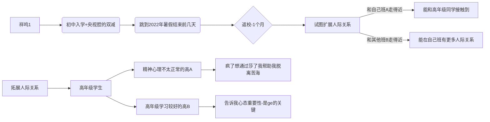

```
开头引入（步入中学）-2022暑假结束前几天-返校一个多月（=w=事实是开学就网课）-网课一个多月-返校躲过期中考试-即将期末考试

第一次来到学校去发展人际关系多交点朋友，看和谁在一起的时间比较多，相应的人际关系也有所不同。目前打算俩选择：高年级生和同级生。此时交的朋友对网课时的生死有关系，为自杀。
返校后最有可能死亡/受伤结局，也许是高年级犯病疯了想通过莎了和自己以前很想的“我”来“帮助我”脱离苦海（迫真）
到了期末考试的话就和最早的那一小段差不多了，也许是最经典的死亡方式（考场敲脑壳）
躲过这些后来到寒假，包括了和朋友翻墙进学校整死的解决和进入教学楼摔死的结局等。这里能玩的就比较花了，全靠之前剧情的一些变量决定什么结局/以及普通的过年看花解决/和适应环境不中二不叛逆的happyend
```



## 开头：

初中入学来到的校门前，bgm突然来个央视腔的双减政策报道之类的，画面一转来到2022年暑假即将结束的时候。

## 暑假结束：

因为马上开学，感到空虚和无力，不知道自己这样活着的意义，不知道自我存在对社会、家庭和自己的价值，摆烂的口气来一句“害，搞不清楚”转到这学期开学（实际上因为疫情全tm上的网课）


这一天没有补课，没有作业，我睡到了9点才起床

天空晴朗，但是暑假结束之际不会感到多么美好

我懒不拉几地爬起来，走出房门

拐角后能看到客厅，停下脚步，墙角对角线另一边是我的桌子。因为不知道什么原因把原本是自己的屋子里的桌子搬了过去，总之默认接受了，但是在客厅学习远不如自己的屋子里舒服，每次父母上厕所之类的都会经过

再过四五天就要开学了，一想到这个我就很难受，不过一想到一旦开学就能和同学朋友说上话就好受得多了

初一就这样过去了，初二就要小升初考试，我的地生成绩太烂了，背东西我也背的不咋地（有的不咋学习的同学的地生小测都比我分数高-这句放到后面）

今天没有什么写的作业，还是去复习预习下吧

## 返校：

来到班级教室，我没有说任何一句话，两个月没有见过的地方竟然就如此陌生。

我看到我身边最好的朋友后并没有直接说话，而是等到老师把事交代完我才和他有了些交流。

我：我勒个去...哥们你暑假过得咋样

他：还...行吧。

我：害，我也差不多。上个厕所去？

他：行，走吧。

*来到走廊，碰到了10班门口的好朋友* -//和哥们是小学同学，关系不错

10班朋友：哇哦，你们好你们好！

哥们：啊啊 啊你好 -//同为社恐内向 //瞎寒碜下一起去撤硕


（此处一堆日常引入故事，~~吸读~~）


## 网课：

（上了两周课，周末出现疫情导致转为网课）
